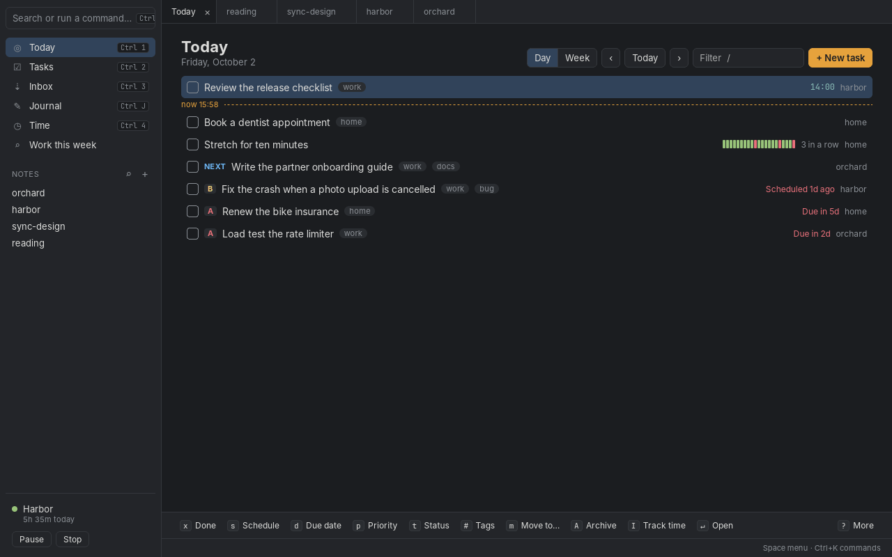
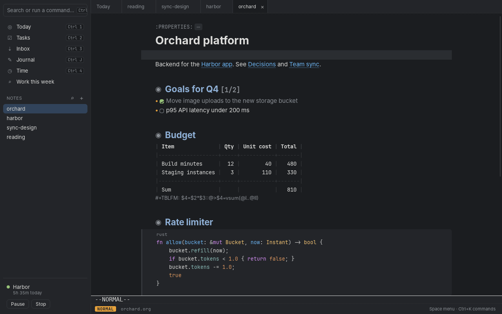
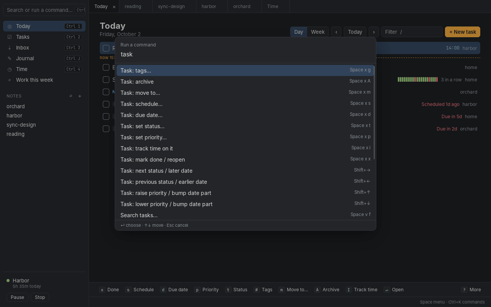
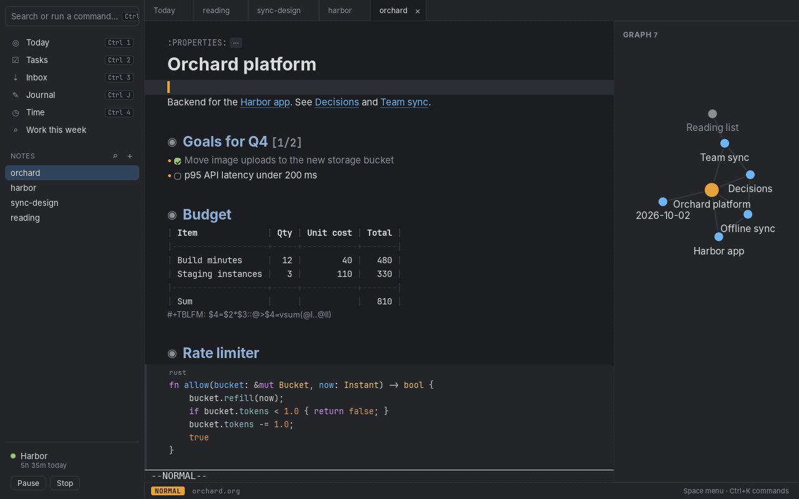
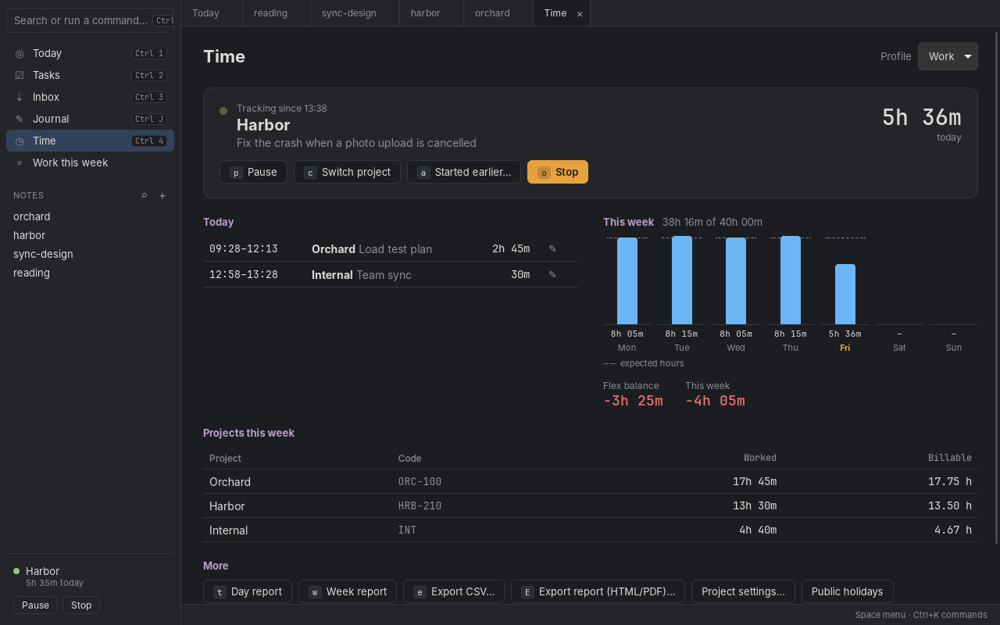

# Margin

Notes, tasks, a journal and time tracking in one fast desktop app (Linux,
macOS, Windows). Notes are plain org files, so they stay readable anywhere;
the editor has vim keys.

- **Notes** — org documents that render like a page: links, backlinks,
  unlinked mentions and a local note graph, tables with formulas, code blocks, inline images, folding.
- **Tasks** — Today and All tasks views, schedules, deadlines, priorities,
  tags, repeaters; capture from anywhere with a global shortcut.
- **Journal** — a daily note, one keypress away.
- **Time** — a timeclock with breaks, projects, flex balance and reports, in
  the window or the tray.
- **Stays in sync** with Emacs, git or any sync tool editing the same files,
  and updates itself from GitHub releases.
  The running version shows at the bottom of the sidebar (and under "About Margin" in the palette).





## Install

Download the latest build from
[Releases](https://github.com/albin02forsberg/margin/releases/latest):

- **Linux** — `.AppImage` (updates itself; `chmod +x` and run), or `.deb` / `.rpm`
- **macOS** — `.dmg` (universal). Ad-hoc signed, not notarized: the first time,
  right-click Margin → Open. If macOS still refuses, run
  `xattr -dr com.apple.quarantine /Applications/Margin.app`.
- **Windows** — `-setup.exe`. Not signed yet: SmartScreen → More info → Run anyway.

## Code signing policy

Release installers are built only by this repository's GitHub Actions
([release.yml](.github/workflows/release.yml)) from a tagged commit on `main`;
nothing is built or signed on a personal machine. Releases are drafted by CI
and published by the maintainer, Albin Forsberg, who approves every release.
Update bundles are signed with the project's updater key so installed copies
only accept builds from this pipeline. macOS builds are ad-hoc signed. Windows
signing via [SignPath Foundation](https://signpath.org) is planned (#13); once
enabled, free code signing will be provided by SignPath.io, certificate by
SignPath Foundation.

Margin sends nothing anywhere except update checks to GitHub Releases (and,
if your time-data folder is a git repo with a remote, backup pushes to it).

## Build from source

```bash
npm install
npm run tauri dev      # run
npm run tauri build    # release bundle for the current OS
cd src-tauri && cargo test
```

## Tests

`npm test` and `cargo test` cover the parsers and engines. `npm run test:e2e`
builds a debug binary (identifier `dev.albin.margin.e2e`, so it never touches
your running copy or settings) and drives the real app through
[tauri-driver](https://v2.tauri.app/develop/tests/webdriver/) against fixture
notes in a temp dir. It needs Linux with `tauri-driver` (`cargo install
tauri-driver --locked`) and `WebKitWebDriver` (`webkit2gtk-driver` on
Debian/Ubuntu); use `xvfb-run -a npm run test:e2e` without a display. CI runs it
in the `e2e` job.

The README screenshots come from the same setup: `npm run screenshots` (same
requirements) starts the app on a made-up demo dataset and writes
`docs/screenshots/*.png`; or run the **Screenshots** workflow (Actions → Run
workflow) and download its artifact. Shrink them before committing, e.g.
`magick mogrify -dither None -colors 256 -strip docs/screenshots/*.png`.

CI runs the checks and tests on every push and PR. To release, bump the
version in `src-tauri/tauri.conf.json`, then push a tag (`git tag v0.2.0 &&
git push --tags`): installers for all three OSes land in a draft GitHub release.
Publishing it makes installed copies offer the update on their next start
(or `Space f u`). Release builds are signed for the updater with the
`TAURI_SIGNING_PRIVATE_KEY` and `TAURI_SIGNING_PRIVATE_KEY_PASSWORD` repo secrets.

## Staying in sync

Everything stays in sync on its own: notes save shortly after you stop typing,
and any change to the notes or time folders — from the app, Emacs or a sync
tool — refreshes open tabs, task lists, links, reports and the timer. If a file
changes underneath unsaved edits, non-overlapping changes are merged; real
conflicts are flagged (`:w` keeps yours, `Space f r` reloads).

## Getting around

New here? The first start asks for your notes folder, time-tracking folder and
hands-on tutorial note (`Space ?` reopens it). Changing folders or dropping the current
profile clocks out first, and warns where old files stay (nothing is moved).
hands-on tutorial note (`Space ?` reopens it).

- **Ctrl+K** — command palette: every action, with its shortcut.
- **Space** (vim normal mode, or in any list view) — the same actions as a menu.
- Sidebar: **Today** (Ctrl+1), **Tasks** (Ctrl+2), **Inbox** (Ctrl+3),
  **Journal** (Ctrl+J), **Time** (Ctrl+4), your saved searches, recent notes.
  Toggle with Ctrl+\\. In a narrow window it shrinks to an icon rail (under 760 px)
  and the links/graph panel opens over the note (under 1000 px; Esc or a click on the note closes it).

| | |
|---|---|
| Ctrl+N | New task (title, when, due, priority, tags, file) |
| Super+Shift+N | Quick capture from anywhere, even with the window hidden (`capture_shortcut` in settings) |
| Ctrl+P | Open a note — or type a title to create one |
| Ctrl+Shift+N | New note |
| Ctrl+Shift+F | Search all notes as you type |
| Ctrl+L | Insert a link to another note |
| Ctrl+S / `:w` | Save (also saves automatically) |



If the shortcut doesn't fire (common on Wayland), bind `margin --capture` to a
key in your desktop's settings instead: it opens the same form in the running app.

## Tasks (Today / Tasks views)

`j`/`k` move, `x` done, `s` schedule, `d` due date, `p` priority, `t` status,
`#` tags, `m` move to another file/heading, `A` archive, `I` track time,
`Enter` open, `<`/`>` reschedule a day, `+`/`-` priority, `n` new task, `u` undo,
`v` day/week, `h`/`l` previous/next, `.` today, `/` filter, `?` all keys.
Click the checkbox to complete a task.

Completing a repeating task logs `- State "DONE" from "TODO" [date time]`
under it and sets `:LAST_REPEAT:`, as org does. Give it `:STYLE: habit` in its
properties and Today (and Tasks) shows a 21-day consistency bar and how many
completions in a row were on time, like org-habit. Past due days follow the
repeater: `+` steps back from the scheduled date, `++` stays on its grid, `.+`
counts from each completion. With a max (`.+2d/3d`) the days between min and
max show amber (due, not yet overdue), after it red:

```org
* TODO Run
SCHEDULED: <2026-10-02 Fri .+1d>
:PROPERTIES:
:STYLE: habit
:END:
```

### Saved searches

"Search tasks…" (`Space v f`) lists the open tasks matching a query, with the
same keys. Terms are space-separated and must all match; `-` negates one:

| | |
|---|---|
| `todo:NEXT` | Status; a done status (`todo:DONE`) searches done tasks too |
| `tag:work`, `-tag:home` | Has / hasn't the tag |
| `pri:A` | Priority |
| `file:inbox` | File name contains |
| `due:today`, `due:<=+7d`, `scheduled:<=fri` | Date compared with `<` `<=` `>` `>=` (none: on that day); any date input works |
| `due:none`, `scheduled:any` | Has no / has a date |
| other words, `"a phrase"` | Title contains |

Values can be quoted too: `file:"my notes"`, `-tag:"x y"`.

`<` and `>` are strict: `due:<+7d` leaves out day 7, so `<=` is usually what
you want.

"Save this search as a view…" (`Space v v`, from a search tab) adds it to the
sidebar; it's kept in settings, where you can rename or edit it:

```toml
[[views]]
name = "Work this week"
query = "tag:work due:<=+7d"
```

Saving a search that already has a view offers to rename that view instead of adding another.
A search tab is titled by its view's name, or by its query once no view has it.

### Capture templates

`Space c` (or "Capture with template…" in Ctrl+K) picks a template, asks its
fields and files the entry, then opens it with the cursor at `%?`. Undo with `u`
in the task views. Define them in settings:

```toml
[[templates]]
key = "m"
name = "Meeting notes"
file = "meetings.org"   # under the notes folder; strftime ok; default: inbox
heading = "Meetings"    # optional: file under this heading, created if missing
body = "* %^{Title} :meeting:\n%U\n- %?"
```

`%t`/`%T` date / date+time (`<2026-10-02 Fri 14:30>`), `%u`/`%U` the inactive
`[…]` forms, `%^{Prompt}` asks (repeat a name to reuse the answer), `%i` the
selected text (extra lines indented like its line), `%?` cursor, `%%` a literal `%`.

Or keep each template as a file in `notes/templates/` (`templates_dir` in
settings); they're listed after the settings ones and left out of the agenda,
tasks and search:

```org
#+title: Meeting notes
#+key: m
#+file: meetings.org
#+heading: Meetings
* %^{Title} :meeting:
%U
- %?
```

All `#+` lines are optional: the key defaults to the file name's first letter,
the name to the file name, the target to the inbox. The rest is the body.

Quick capture (Super+Shift+N) asks "Task" or a template when you have any; a
template captured with the window hidden is filed without opening it.

## Editing notes

Vim keys everywhere. On top of that:

| | |
|---|---|
| Tab / Shift+Tab | Fold heading / fold everything |
| Alt+Enter | New heading, or next list item |
| Alt+Shift+Enter | New task heading |
| Alt+H / Alt+L (+Shift) | Promote / demote heading (with children) |
| Alt+J / Alt+K | Move heading down / up |
| Shift+← / → | Change task status, or move a date by a day |
| Shift+↑ / ↓ | Change priority, or the date part under the cursor |
| Enter, gf, Ctrl+click | Follow a link |
| click `[ ]` | Toggle a checkbox |
| Space x … | Task commands for the heading at the cursor |
| Space n b | Notes linking here, plus unlinked mentions of this note's title (**Link** turns one into an `[[id:]]` link; Space n u undoes) |
| Space n g | Graph of notes within two links of this one; click a note to open it |



Dates accept `today`, `tomorrow`, `fri`, `+3d`, `-1w`, `12-24`,
`2026-12-24 14:00`; the input shows what it understood.

## Writing in org

Notes render like a document: markup (stars, link brackets, `*bold*` markers,
checkbox brackets, block delimiters) is hidden except on the line you're on, so
the file stays plain org text. Prose uses a proportional font; tables, code and
dates stay monospace (`Space v m` switches everything to monospace).

| | |
|---|---|
| Tab / Shift+Tab in a table | Align and move to the next / previous cell (adds rows at the end) |
| Enter in a table (insert mode) | Same column, next row |
| Alt+H/J/K/L in a table | Move column / row |
| Alt+Shift+H/L, Alt+Shift+J/K | Delete / insert column, insert / delete row |
| `\|-` then Tab | Expands into a separator line |
| `<s`, `<q`, `<e`, `<v` + Tab | Code, quote, example, verse block |
| Ctrl+Shift+O | Go to a heading in this note |
| Space i … | Insert table, code block, quote, link, date, rule |
| Space T … | Table: rows, columns, separator, sort, align |
| `[/]` or `[%]` in a heading | Progress cookie, updated when you tick checkboxes or finish child tasks |

Image links (`[[file:pic.png]]`, `[[https://…/pic.jpg]]`) show the image inline.

Drop files onto a note, or paste an image (saved as `pasted-YYYYMMDD-HHMMSS.png`),
and Margin copies them into `attachments/<note name>/` in your notes folder and
inserts a relative `[[file:…]]` link, so notes stay portable. Same-named files get
`-1`, `-2` suffixes; set `attachments_dir` to use another folder.
**Clean up unused attachments…** in the palette lists files in that folder no note
links to and moves the ones you pick to `attachments/.trash/` (nothing is deleted).

Code blocks (`#+begin_src python` …) are syntax highlighted for any language
CodeMirror knows (python, rust, js/ts, sh, sql, go, java, c, html, css, yaml, …).

### Table formulas

Put formulas on a `#+TBLFM:` line under the table, separated by `::` — or type
`=expr` (whole column) or `:=expr` (just this cell) into a cell and press Tab.
They recalculate as you Tab/Enter through the table, on `Space T r`, or with Tab
on the `#+TBLFM` line.

```org
| Item   | Qty | Price | Total |
|--------+-----+-------+-------|
| Coffee |   3 |   2.5 |   7.5 |
| Paper  |  10 |   0.2 |     2 |
|--------+-----+-------+-------|
| Sum    |  13 |       |  9.50 |
#+TBLFM: $4=$2*$3::@>$4=vsum(@I..@II);%.2f::@>$2=vsum(@I..@II)
```

References: `$3` column, `@2` row, `@2$3` field, relative `@-1` / `$+1`, `@<` /
`@>` first / last row, `@I` / `@II` separator lines, ranges `@2..@-1` or
`@2$1..@4$3`. Operators `+ - * / ^`; functions `vsum vmean vmin vmax vcount
vmedian abs round floor ceil sqrt exp ln`; format with `;%.2f` or `;%d`.

## Time tracking



The Time view shows what you're tracking, today's sessions (click ✎ to edit),
the week's hours against expected, flex balance and per-project totals. Keys:
`i` start, `p` pause, `r` resume, `c` switch project, `o` stop, `e` export CSV (import template: `Project` = export code, `Duration` in decimal hours, `1,5`),
`E` export a report as HTML/PDF.
Space t … has every timeclock command (same letters as the old Emacs menu).
Time → Project settings (`Space t P`) opens a Projects page listing every project
with its export code, billable-hour rounding, round-up and whether it's offered
when you start tracking; change any of them and press Save (or Enter) on that row.
If `projects.toml`, the time log or the diary can't be read or parsed (say, after
a bad hand edit), commands that would rewrite it show an error and leave the
file alone instead of starting over from empty. CSV and HTML/PDF exports fail with the
parse error rather than writing project names as export codes, the Projects page and
the project picker show the error instead of an empty list, and Time → Check log
(also run after saving `projects.toml`) lists the error.

The tray icon shows what you're tracking and for how long, and has start,
break, resume, switch and stop. Closing the window while a timer runs hides it
to the tray (`close_to_tray = false` in settings to quit instead).

Coming back after 10 minutes idle (or asleep) with a timer running asks whether
to keep that time, discard it (clocked out when you left, back in when you
returned) or discard it and stop. `idle_threshold_minutes` sets the time, 0
turns it off. On Wayland this uses the compositor's idle notifications
(KDE Plasma 6, Sway/wlroots, GNOME 46+), and the threshold applies after a restart;
elsewhere only sleep and suspend are noticed.

### Suggested time from ActivityWatch

If you run [ActivityWatch](https://activitywatch.net/), set
`activitywatch_url = "http://localhost:5600"` and the Time view lists
**Suggested** sessions for the day: stretches of computer use (gaps under 5
minutes joined, AFK and already logged time left out, at least 15 minutes),
with the top apps and window titles and a project guessed from its name
appearing in them. With the browser extension (aw-watcher-web) installed, time
in a browser shows as the page's site and path (`github.com/you/repo`) instead
of its title, which also helps the project guess; private tabs are left out.
**Accept** confirms the project and an optional diary note and adds the session
to the log at its place in the day; ✎ lets you change its start and end first;
✕ hides it, and anything overlapping it, for good (kept in
`activity_dismissed.json` in the profile's data folder for 30 days). `h`/`l`
step through days. Only local addresses are accepted, and `activity_exclude`
(regexes over app names, window titles and URLs; password managers and private
browsing by default) keeps windows and pages out of suggestions. Off by default.

### Drafts from a local model

Margin can draft diary and journal notes with a small model running on your own
machine through [Ollama](https://ollama.com), so it stays free and nothing
leaves your computer. Install Ollama, run `ollama pull llama3.2:3b` (any 1–3B
model works; `qwen2.5:3b` is another good one), then pick **Ollama** with
**AI drafts: choose model…** (`Space f a`) and enter the model name (or set
`ai_backend = "ollama"` and `ai_model = "llama3.2:3b"` in settings). `ai_url`
defaults to `http://localhost:11434`; only local addresses are accepted. Off
while `ai_model` is empty (the default).

The same picker lists models Margin will download and run itself, without
Ollama (`ai_backend = "embedded"`): Qwen2.5 3B Instruct (the default, ~2.1 GB,
Qwen Research licence: non-commercial use only) and Qwen2.5 1.5B Instruct
(~1.1 GB, Apache-2.0). Nothing is bundled or downloaded yet: the download and
running them inside Margin arrive in later updates
([#132](https://github.com/albin02forsberg/margin/issues/132)).

- **Accept** on a suggestion offers to draft the diary note from that block's
  project, apps and titles; it lands in the note prompt for you to edit.
- `Space n s` (Journal: draft summary of today) drafts a few bullet points from
  today's sessions and, with ActivityWatch on, the top window titles, and adds
  them under `* Summary` in today's journal. `Space n u` undoes it.

Both show exactly what the model gets and send nothing until you confirm.
`activity_exclude` titles are never included.

## Export

`Space e` exports the open note (including unsaved edits) as HTML (`e h`),
Markdown (`e m`) or PDF (`e p`), and the time report for the last 7 days, this
month, last month or a custom range as HTML or PDF (`e t`, or `E` in the Time
view). Files go to `export_dir` (default `~/Desktop`); if one is already there you
choose Overwrite, Keep both (saves `name (2).html`) or Cancel. PDF writes the
HTML page and opens it in your browser with the print dialog up — choose "Save as
PDF" there. Property drawers, planning lines, comments and `#+` keywords other
than the title are left out; `id:` links become plain text. Images are embedded
in the HTML, so the page works on its own; bare URLs become links, and
`term :: text` lists and verse blocks keep their shape.

`e a` exports the note plus the notes it links to by `id:` (one hop, or two) as
HTML or Markdown pages in a folder `export_dir/<note>/`, where links between them
work, or as one PDF (`export_dir/<note> (linked).html`) with a page break between
notes and links jumping to the right section. Overwriting the folder moves pages
(`.html` / `.md`) from an earlier export that are no longer included into its
`old/` subfolder; other files in it stay.

## Reminders

Timed entries (`SCHEDULED: <… 14:00>`, deadlines with a time, appointments)
pop up a desktop notification 10 minutes before; date-only deadlines remind you
once a day from the day before. Clicking one opens the task (Linux; elsewhere
notifications are display-only for now). Settings: `reminders`, `remind_before_minutes`,
`deadline_warning_days`.

## Calendar

Set `calendar_file` (e.g. `"~/Sync/margin.ics"`) and Margin keeps an iCalendar
file of open tasks' schedules, deadlines and appointments up to date, with
repeaters. Subscribe to it from your calendar app (or a synced copy of it).
Timed entries show as one hour; the rest are all-day.

## Settings

Ctrl+, opens `config.toml` (in the OS config dir): notes folder (`~/notes`),
time data folder (`~/timeclock`), inbox file, journal folder, task statuses,
profiles and expected daily hours. It's created with the defaults on first run;
an existing file that can't be read or parsed is left alone and the app runs on
the defaults until it's fixed, saying so (with the error) at startup. Old Emacs timeclock data can be imported from
the Time view.
